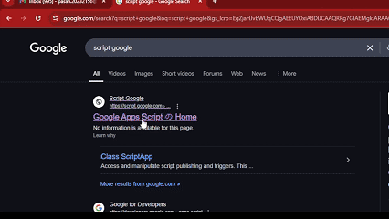
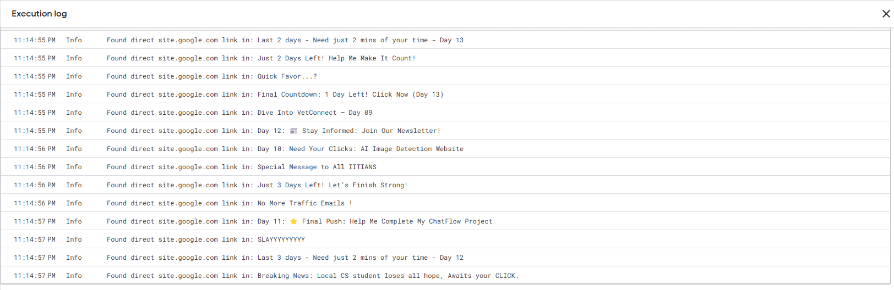
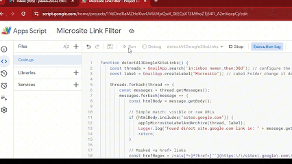
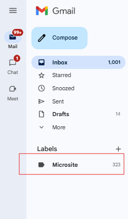

---

# 📧 IIT Gmail Microsite SPAM Filter (Google Apps Script)


This Google Apps Script filters your Gmail Inbox to find emails that contain links to `sites.google.com`, even if they are **masked behind custom text** like "Click Here". It then:

- Labels those emails under a folder called **Microsite**
- Archives them to remove from the **Inbox**
- Keeps your inbox clean from unwanted promotional website links

---

## 🎓 Who Is This For?

This script is made specifically for **IIT (Institute of Information Technology)** students who want to automatically filter out emails that promote personal websites using Google Sites. No coding knowledge is required — just copy, paste, and set it up!


## 🚀 What It Does

✅ Detects:
- Visible links like `https://sites.google.com/...`
- Masked links like `[Click Here](https://sites.google.com/view/project/home)`

✅ Automatically:
- Labels the email as `Microsite`
- Moves it out of the Inbox (archived)
- Runs on all Inbox emails received in the last **30 days**

---

## 🛠️ How to Install and Use

> You don't need to deploy anything. Just follow the steps below.

---

### 🔧 Step 1: Open Google Apps Script

1. Go to [https://script.google.com](https://script.google.com)
2. Click **`+ New project`**
3. Name your project (e.g., `Microsite Link Filter`)

---

### 📋 Step 2: Copy and Paste the Script

Replace the default `Code.gs` content with the code below:

```javascript
function detectAllGoogleSiteLinks() {
  const threads = GmailApp.search('in:inbox newer_than:30d'); // configure the dates you need to scrap
  const label = GmailApp.createLabel("Microsite"); // Label Folder change it desired name

  threads.forEach(thread => {
    const messages = thread.getMessages();
    messages.forEach(message => {
      const htmlBody = message.getBody();

      // Simple match: visible or raw URLs
      if (htmlBody.includes("sites.google.com")) {
        applyMicrositeLabelAndArchive(thread, label);
        Logger.log("Found direct site.google.com link in: " + message.getSubject());
        return;
      }

      // Masked <a href> links
      const hrefRegex = /<a\s[^>]*?href=["'](https:\/\/sites\.google\.com\/[^"']+)["'][^>]*?>.*?<\/a>/gi;
      let match;
      while ((match = hrefRegex.exec(htmlBody)) !== null) {
        const foundUrl = match[1];
        if (foundUrl.includes("sites.google.com")) {
          applyMicrositeLabelAndArchive(thread, label);
          Logger.log("Found masked link to: " + foundUrl + " in: " + message.getSubject());
          break;
        }
      }
    });
  });
}

// Label thread and remove from Inbox
function applyMicrositeLabelAndArchive(thread, label) {
  const existingLabels = thread.getLabels().map(l => l.getName());
  if (!existingLabels.includes(label.getName())) {
    thread.addLabel(label);
  }
  thread.moveToArchive(); // removes it from Inbox
}
```

---

### ▶️ Step 3: Run the Script Once

1. Click the `▶️ Run` button (in the top toolbar)
2. It will prompt you for authorization — allow permissions for Gmail
3. The script will scan your Inbox for `sites.google.com` links and start filtering




---

### ⏰ Step 4: Schedule It to Run Automatically (Optional)

1. In the Apps Script editor, click the **clock icon** (Triggers)
2. Click `+ Add Trigger`
3. Configure:
    - Function: `detectAllGoogleSiteLinks`
    - Event source: `Time-driven`
    - Type: `Day timer`
    - Time of day: e.g., `7:00am to 8:00am`

This will automatically run the filter every morning.



---

## 📂 Where Do Filtered Emails Go?

- They are moved out of your Inbox
- You can find them under the **`Microsite`** label in Gmail


---

## 📌 Notes

- You can change `"Microsite"` to any label name you prefer
- You can update `newer_than:30d` to scan a different time range (like `10d` or `1d`)
- This script works only for the emails in your own Gmail account

---

## ❌ To Stop It

If you no longer want to run the filter:
- Go to the **Triggers** tab and delete the trigger
- Or just delete the script project from your Apps Script dashboard

---

## ✅ Requirements

- your IIT Gmail Account eg: `spammer.2023233@iit.ac.lk`

---


